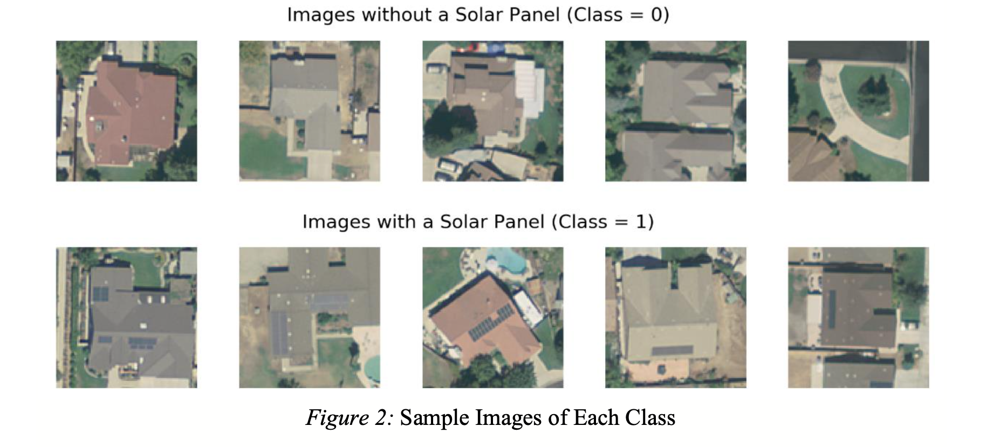

# Solar_PV_in_Aerial_Imagery_Kaggle

**Objective**

This project is to classify 1500 satellite images based on the presence of solar PV.

**Data**

**Methods**

A Support Vector Machine (SVM) employing histogram of oriented gradients (HOG) and a Convolutional Neural Network (CNN). 

**Results**

The SVM and CNN had cross-validated AUCs of 0.8215 and 0.9983, respectively, indicating very strong overall classification performance.

